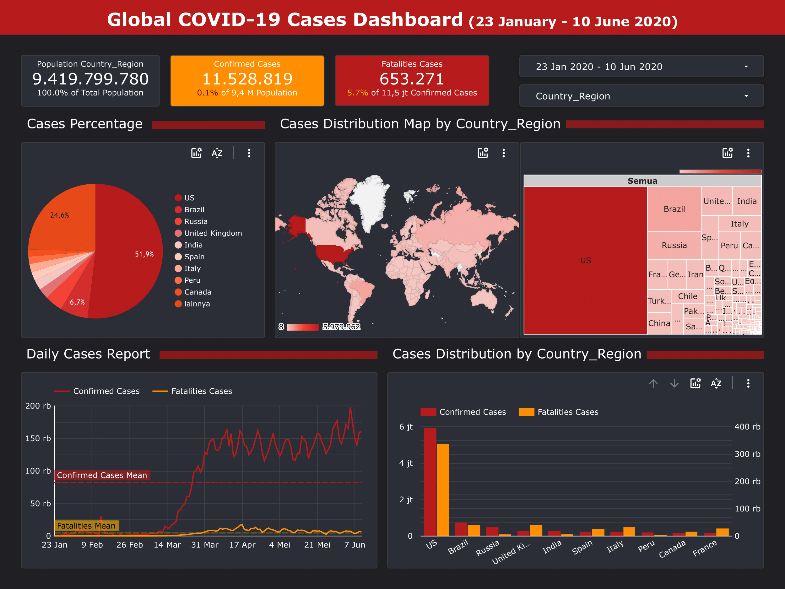

# Portofolio

---
## Dashboard Project with Looker Studio
[[View in Looker Studio](https://lookerstudio.google.com/u/0/reporting/91bf1935-d8fc-4db8-8481-67e7048cef71/page/U4CSD)]

**Global COVID-19 Cases Dashboard**

---
### SQL Project for `dvdrental` Dataset
[[View in Google Drive](https://drive.google.com/file/d/1dMi9vW5UKL4p3B84dJ2Sz26ytQth6p-3/view?usp=sharing)]

By using PostrageSQL, several variables will be searched as follows:
1. The top 10 customers and their email so we can reward them.
2. The bottom 10 customers and their emails.
3. The most profitable movie genres (ratings).
4. The number of movies were returned late, early, and on time.
5. The customer base in the countries where we have a presence.
6. The most profitable country for the business.
7. The average rental rate per film genre (rating).

---
### GUI Python R & S Control Chart 

Control chart serves as a tool to communicate information about performance of a process between production groups between suppliers or between machine operators. Meanwhile, the statistical control chart or control chart is a method Statistics used to describe variations or deviations from quality (quality) of the desired production results. An example of a control chart is a control chart R and S. Control chart R is the control chart used to monitor the level of accuracy of the process by looking for a range of samples. While the control chart S is a control chart used to monitor the level of accuracy of the process by finding the standard deviation of the sample. Graphical user interface (GUI) is a system of interactive visual components for computer software. The GUI displays objects that can convey information and represents the action of the user. With the GUI, we can know that what we input has been received and the response is shown visually.

---
_**Create by berlianaspanic**_
