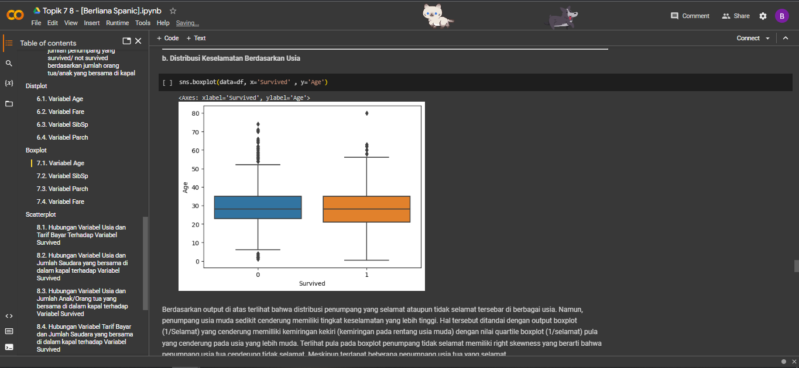
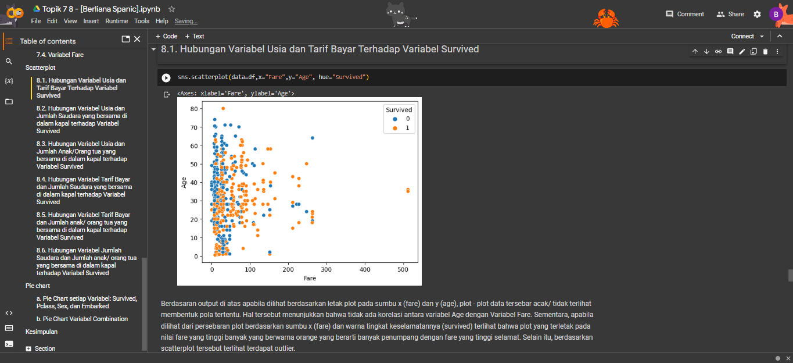

# Portofolio

---
## Dashboard Project with Looker Studio
[[View in Looker Studio](https://lookerstudio.google.com/u/0/reporting/91bf1935-d8fc-4db8-8481-67e7048cef71/page/U4CSD)]

**Global COVID-19 Cases Dashboard**

---
### SQL Project for `dvdrental` Dataset
[[View in Google Drive](https://drive.google.com/file/d/1dMi9vW5UKL4p3B84dJ2Sz26ytQth6p-3/view?usp=sharing)]

By using PostrageSQL, several variables will be searched as follows:
1. The top 10 customers and their email so we can reward them.
2. The bottom 10 customers and their emails.
3. The most profitable movie genres (ratings).
4. The number of movies were returned late, early, and on time.
5. The customer base in the countries where we have a presence.
6. The most profitable country for the business.
7. The average rental rate per film genre (rating).

---
## Python Project

### Clustering with Python for `Mall Customer` Dataset

  

Clustering is a technique of machine learning algorithms, namely unsupervised learning. The clustering algorithm divides the population or data points with the same characteristics into several small groups to be grouped. This technique is one of the algorithms in machine learning that is most often used by companies to segment their customers so that they can increase sales in their company.

---
### Regression Modelling with Python for `House Prices` Dataset

Regression is a method that functions to predict or estimate the effect of two or more certain functional variables.

---
### Exploratory Data Analysis for `Telco Churn` Dataset

Exploratory Data Analysis is an approach to analyze the data to discover trends, patterns, or to find assumptions with the help of statistical summary and graphical representations. Important things in Exploratory Data Analysis is identify errors in dataset, gives a better understanding of the dataset, detect outliers, understand dataset variables and the relationship among them.

---
### Statistics for Data Analysis

In this project using diabetes patient dataset, shown the Descriptive Statistics measure of central tendency, measure of spread, and distribution of each variabels data.

---
### Data Visualization in Python

Data Visualization is the graphical representation of information and data. There are 4 pillars of 
visualization: Comparison, Distribution, Relationship, and Composition. In this project, Visualization data using Barplot to Comparison, Distplot and Boxplot to Distribution, Scatterplot to Relationship, and Piechart to Composition.

---
### Data Preprocessing with Pandas

Data preprocessing is the process of converting raw data into a form that is easier to understand. In this project, data preprocessing is done using the join, merge, delete, rename, group by, and aggregation functions.

---
### Telco Chrun Dataset Cleansing and Handling

Data cleansing is the process of modifying or deleting data that is considered inaccurate, duplicate,
incomplete, malformed, or damaged in the data set owned. Data cleansing is related
with the preparation of data for the needs of data analysis later. Data cleansing needs to be done because
data is never available in a clean state / ready for direct analysis. In addition, usually data
has various problems that can hinder the analysis process such as Inconsistent column
names, Missing data, Outliers, and so on.
  
  Data cleaning has been carried out with the aim of:
1. Missing value checking and handling
2. Categorical data encoding
3. Outlier handling.

---
### GUI Python R & S Control Chart 

Control chart serves as a tool to communicate information about performance of a process between production groups between suppliers or between machine operators. Meanwhile, the statistical control chart or control chart is a method Statistics used to describe variations or deviations from quality (quality) of the desired production results. An example of a control chart is a control chart R and S. Control chart R is the control chart used to monitor the level of accuracy of the process by looking for a range of samples. While the control chart S is a control chart used to monitor the level of accuracy of the process by finding the standard deviation of the sample. Graphical user interface (GUI) is a system of interactive visual components for computer software. The GUI displays objects that can convey information and represents the action of the user. With the GUI, we can know that what we input has been received and the response is shown visually.

---
_**Create by berlianaspanic**_
